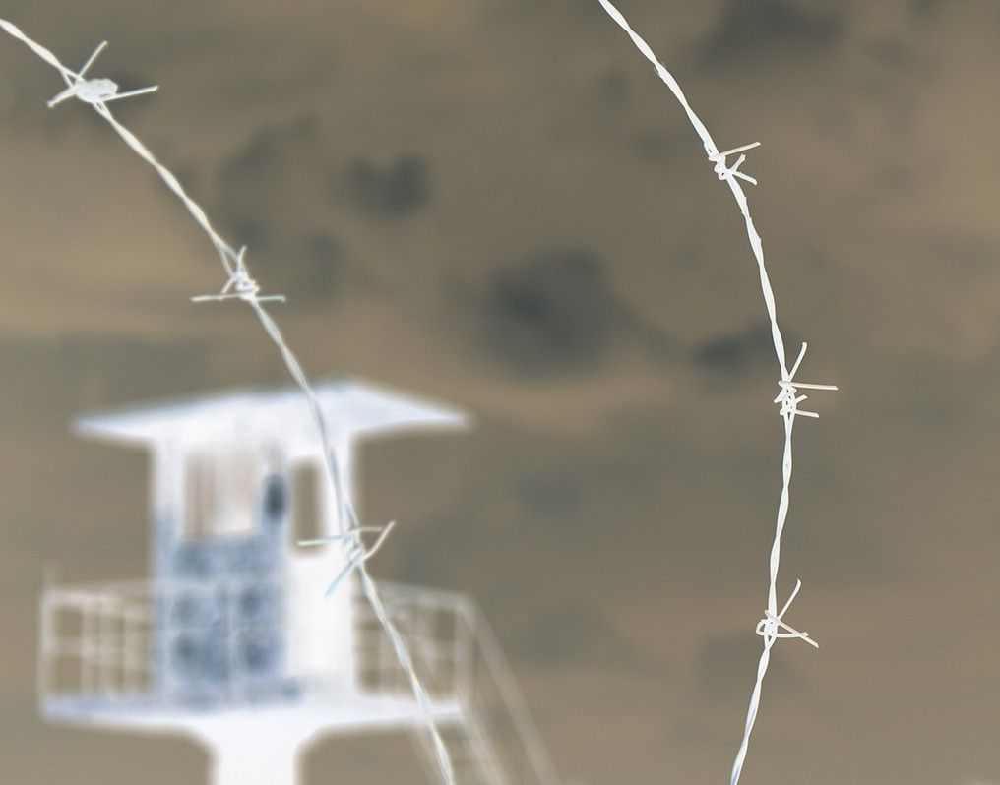
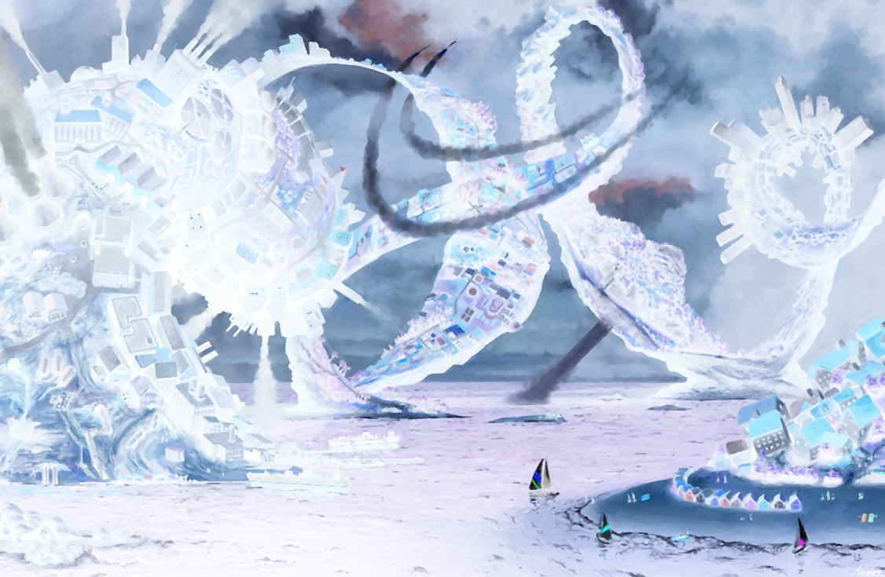

# Image-Processing-and-Filtering

Ιt is implementation of project in C++ course.

# Description 

* Image Processing and Filtering for images in PPM format implemented in C++.

**Processing**
 * Program opens a corresponding image and save it to a snapshot of an Image class using a ReadPPM function. Then indicate the size of the image on the command line, calculate its negative, and save it to a new file using the WritePPM function.

**Filtering**
 * Implementation of  two specialized filters as offspring of the basic Filter class,FilterGamma and FilterLinear
 
 # Run Instractions 
 
 * For Processing 
 
 1. Open command line 
 2. type make for Makefile
 3. ./neg 
 4. type the File name of the Image
 
 
 
 * For Filtering
 
 1. Open command line
 2. type make for Makefile 
 3. filter -f first filter parameters -f  second filter parameters Image name (ex.filter -f gamma 2.0 -f linear -1 -1 -1 1 1 1 Image01.ppm)
 

 
